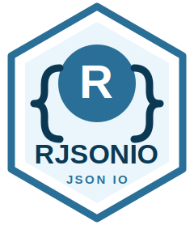

# RJSONIO



[](https://CRAN.R-project.org/package=RJSONIO)
[](https://github.com/YaoxiangLi/RJSONIO/actions/workflows/pkgdown.yaml)

`RJSONIO` converts R objects to and from JSON. It provides a stable API for
serializing R vectors, lists, data frames, arrays, environments, and S4 objects,
and for reading JSON from strings, files, and connections.

## Installation

Install the CRAN release:

```r
install.packages("RJSONIO")
```

Install the development version from GitHub:

```r
install.packages("remotes")
remotes::install_github("YaoxiangLi/RJSONIO")
```

## Quick Start

```r
library(RJSONIO)

x <- list(
  id = 1,
  name = "RJSONIO",
  values = c(1, 2, 3),
  active = TRUE
)

json <- toJSON(x, pretty = TRUE)
cat(json)

fromJSON(json)
```

Validate JSON before parsing:

```r
candidate <- toJSON(list(name = "RJSONIO", version = "2.0.2"))
isValidJSON(I(candidate))
```

Round-trip common R objects:

```r
value <- list(a = 1, b = c(TRUE, FALSE), c = c("x", "y"))
identical(fromJSON(toJSON(value)), value)
```

## API Stability

The unit test suite includes compatibility coverage for parsing, serialization,
simplification modes, encodings, connections, edge cases, and string callbacks.

## Documentation

- Package website and articles: <https://yaoxiangli.github.io/RJSONIO/>
- CRAN page: <https://CRAN.R-project.org/package=RJSONIO>
- Issues: <https://github.com/YaoxiangLi/RJSONIO/issues>

## Development

Run the unit tests:

```r
testthat::test_local()
```

Run a package check:

```sh
R CMD build RJSONIO
R CMD check --no-manual RJSONIO_2.0.3.tar.gz
```
